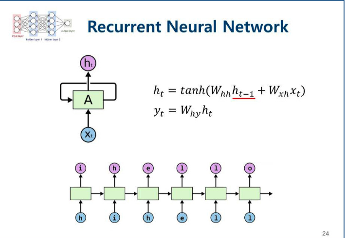

# RNN

Recurrent/Neural/Network 의 약자로 **순환 신경망**을 뜻한다.
시간의 흐름에 따라 변화하는 데이터를 학습하기 위한 인공신경망이다.
자기 자신을 참조하며 현재 결과가 이전 결과와 연광성을 가진다.

### 대표적인 예시: 문장을 완성해주는 알고리즘
문장 같은 경우 앞 뒤 데이터간의 연관성이 있다. 
예를 들어 "배고"라는 단어 뒤에는 "파"라는 단어가 나올 확률이 높고, "eleph" 뒤에는 "ant"라는 단어가 나올 확률이 높다.
단어 하나에 인덱스 정수를 할당하는 방법인 Bag of Words라는 방법을 사용한다.

#### 사용되는 분야
- 음성인식
- 통번역
- 챗봇
- 영상의 자막 자동입력