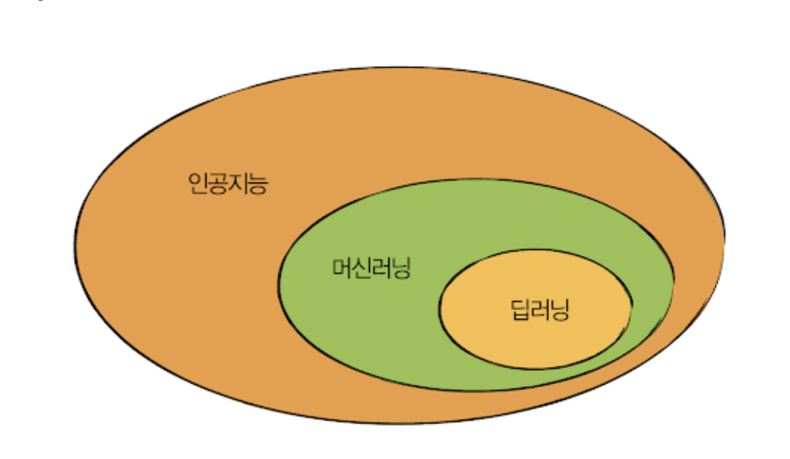

# 인공지능, 머신러닝, 딥러닝

인공지능 > 머신러닝 > 딥러닝 이 순서로 이루어져있다.

## 인공지능이란?

- 인공적으로 지능을 만든 것
- 점진적인 학습 알고리즘을 통해 스스로를 개선
- 자동화와 최적화를 위해 인공지능을 사용한다.

### 규칙기반이란?
인공지능 내에서 머신러닝에 포함되지 않는 인공지능

## 머신러닝이란?
- **인간의 개입 없이** 기계가 스스로 학습하는 기술 
- 지속적으로 데이터를 전달한다.
- 객체에 대한 답을 제공하고 그 답을 해석하며 스스로 학습한다.

## 딥러닝이란?
- 깊에 쌓은 모델을 학습한다.
- 인간의 뇌를 모방하여 깊이 샇은 뉴럴렛 모델을 사용
- DNN, CNN, RNN이 있다.

### 지도학습?
- 모델의 입력값과 정답 데이터를 모두 사용하여 학습하는 방법
- 정답을 알려주기에 학습이 잘 된다. 
- 레이블링을 하나하나씩 해줘야해 귀찮다.

### 비지도학습?
- 입력값만 사용
- 레이블링을 해줄 필요가 없다.
- 비용 절감 효과가 있다.
- 지도 학습에 비해 학습이 어렵다.

### 정형데이터?
- 테이블 구조의 데이터
- 컴퓨터가 이해하기 쉽다

### 비정형데이터?
- 이미지, 동영상, 텍스트, 음성으로 되어 있는 데이터
- 컴퓨터가 이해할 수 있게끔 임베딩을 해줘야한다.