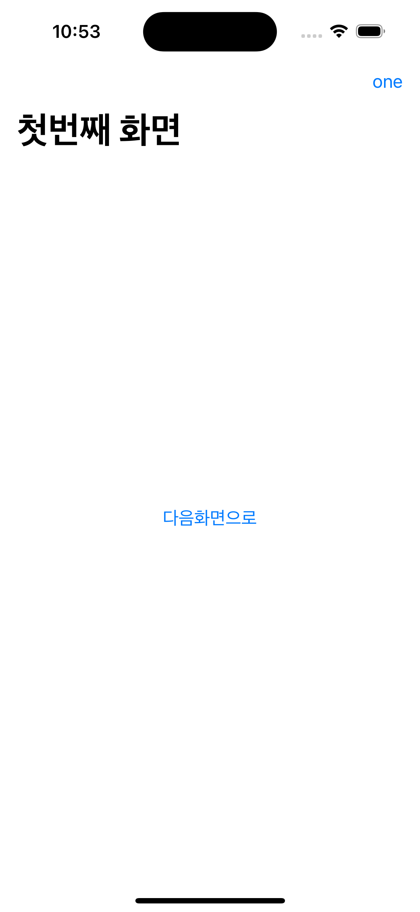

# Navigation

UIKit에서 NavigationViewController를 상속받았다면, 
SwiftUI에서는 NavigationView를 상속 받아야한다. 

## NavigationView

NavigationView를 만드는 방법은 간단한데

```swift
NavigationView {

}
```
와 같이 만들어주면 끝이다!!

NavigationView는 항상 최상위에 위치해야 하지만, TabView를 사용할때에는 NavigationView가 TabView 내에 있어야한다.

NavigationView와 NavigationLink를 만들어보자

```swift
struct FirstView: View {
    
    var body: some View {
        NavigationView {
            NavigationLink("다음화면으로") {
                SecondView()
            }
            .navigationBarTitle("첫번째 화면")
        }
    }
}
```

이렇게 ```NavigationLink("다음화면으로 갈 버튼의 텍스트")``` 그리고 ```NavigationLink{}``` 에는 내가 버튼을 클릭하였을때 갈 화면을 적어주면 된다.




또한 여기 보이는 첫번째 화면처럼 navigationBarTitle과 Navigation bar button도 만들 수 있다. 

## NavigationStack

하지만 WWDC 22 이후 NavigationView는 찬밥신세가 되어버렸고, 이걸 대신하는 NavigationStack가 생겼다.
(NavigationStack/NavigationSplitView는 iOS 16 이상부터 쓸 수 있기 때문에 사용하려면 Deployment Target이 16이상인지 확인해봐야한다.)


