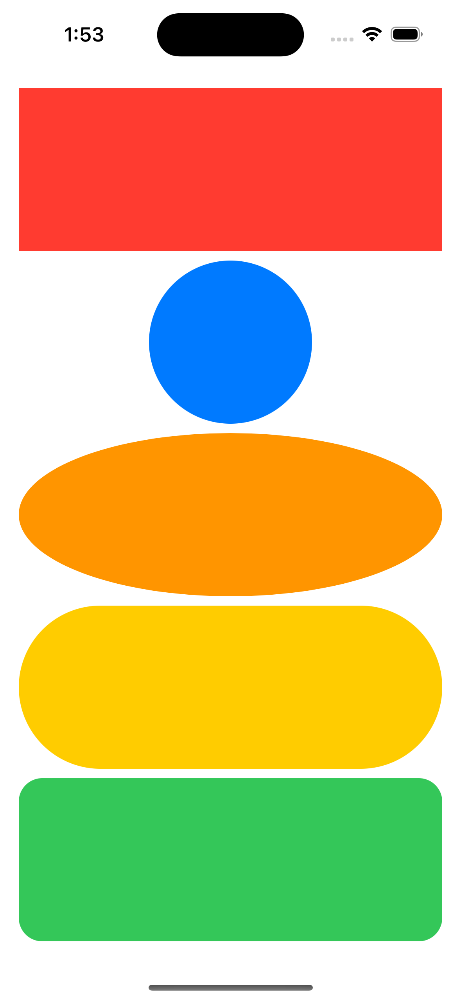

# Shape

### 정의
-  원, 타원, 사각형, 둥근 사각형, 캡슐 모양을 그릴때 쓴다. (UIKit에서는 View를 그린다음 직접 설정해줬어야 했는데 이렇게 모양을 설정할 수 있어 더 편한듯!)
  
  

  사각형 - 원 - 타원 - 캡슐 - 둥근 사각형 순서입니다.

### Modifiers
```swift
Circle()
    .stroke(Color.pink) // 원의 테두리의 색깔을 설정할 수 있다    
    .stroke(Color.pink, lineWidth: 20) // 원의 테두리의 색깔 + 두께를 설정할 수 있다
    .stroke(Color.orange, style: StrokeStyle(lineWidth: 30, lineCap: .round, dash: [40])) // 테두리 두께 + 테두리의 스타일 + 얼마나 나눌지 설정할 수 있다
    .frame(width: 150, height: 150) // 크기를 설정할 수 있다.
    .foregroundColor(Color.blue) // 백그라운드 색깔을 설정할 수 있다.  
 ```

### Trim
```swift
Circle()
    .trim(from: 0.5, to : 1.0) // 원을 나눌때 쓴다. from부터 to만큼의 크기를 나눈다고 생각하면 된다.
```


