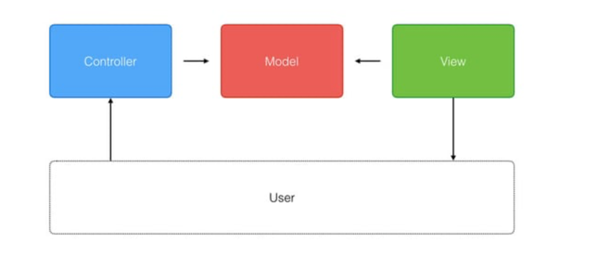
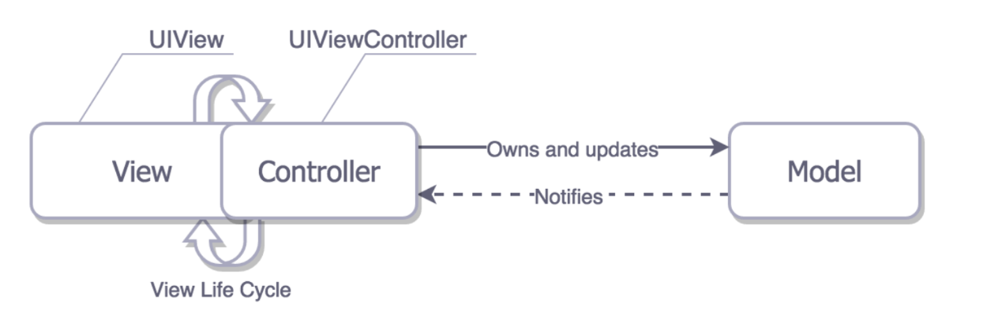

# ios 에서는 MVC 패턴을 어떻게 사용할까 ?

일단 MVC란 무엇인지 알아보자! 

MVC란 `` Model, View, Controller``를 합친 단어로 하나의 디자인 패턴이다.

각자의 역할을 알아보자

* Model - 데이터의 로직
* View - 데이터를 사용자에게 보여주고 UI를 담당
* Controller -  Model과 View의 중간다리 역할

 원조 MVC의 형태이다.

 Controller가 사용자로부터 데이터를 받아오고, 그 데이터를 모델에게 전달해 데이터를 업데이트한다.
 뷰에서 모델로부터 데이터를 받아와 화면에 보여주는 역할을 한다.

 여기서 드는 의문점 : *Model과 View는 전혀 다른 역할을 하는데 서로 의존을 해야되는 이유가 있을까??*

 이 의문점을 해결하기 위해 나타난게 iOS만의 MVC 패턴 방식이다

 

 View가 사용자로부터 데이터를 받아오고, 그 데이터를 Controller에게 전달한 뒤 Model에서 데이터를 업데이트한다.

 *Model과 View가 서로 의존을 해야 될 필요가 없어서 저렇게 나눈걸 알겠는데 나눴을때의 장점이 그래서 뭐지? 🤔*
 
 바로 **재사용성** 이 높아진다!!
Model과 View의 의존성이 낮기 때문에 다시 사용을 하더라도 메모리에 큰 지장이 없다.
s
~~하지만 Controller가 무거워진다는 단점이 있다..~~

이런 장점만 있었다면 다들 MVC를 사용하고 있었을텐데 단점에는 어떠한 것들이 있는지 봐보자!

### View와 ViewController의 강결합!! ###

ViewController가 View를 직접 생성하고 사용하는데다, View 또한 대부분의 로직을 ViewController에게 위임하기까지 하니까, **결합도가 굉장히 높아질 수 밖에 없다.**

ViewController가 View의 Life cycle을 관리하고 있기에 -> **View와 ViewController를 따로 나누기 어렵다 !**

View와 ViewController를 나누기 어렵기 때문에 -> **유닛 테스트 또한 하기 어렵다.**

### MVC만의 장점!

* 생산성이 높고 쉽다!
* 애플에서 기본적으로 지원하는 패턴이기 때문에 쉽게 접근할 수 있다.
* 이미 많은 개발자들에게 친숙한 패턴이기 때문에 쉽게 유지보수할 수 있다.
* 각 구조의 역할이 명확하기에 쉽고 빠르게 개발할 수 있다.

MVC에 대해 설명해보았다.

MVC의 문제점을 해결해 등장한게 MVVM이라고 알고 있는데 MVVM에 대해서 공부하고 글을 올려봐야겠다!

긴글 읽어주셔서 고맙습니다:)