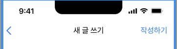

# RightBarButtonItem



여기에 보이는 "작성하기"와 같이 오른쪽에 무슨 버튼이 있는 걸 볼 수 있다.

이건 RightBarButtonItem이라고 하는건데

```swift
navigationItem.rightBarButtonItem = UIBarButtonItem(barButtonSystemItem: .search, target: self, action: #selector(didTapRightBarButton))
```

위와 같이 설정하면 된다.


