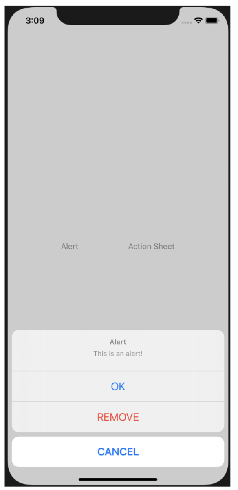

# ActionSheet

```swift
let alert = UIAlertController(title: "Alert", message: "This is an alert!", preferredStyle: .actionSheet )

```
 preferredStyled을 .actionSheet으로 설정해주면 위와 같이 



아래에 경고창이 뜹니다.

alert문을 적어준 뒤 addaction을 적어주면 원하는 상태들의 버튼이 추가된걸 볼 수 있습니다.

참고 : https://bes24.tistory.com/52#1%EF%B8%8F⃣%C2%A0UIAlertController를%20사용하여%20알림%20창의%20전체적인%20부분%20만들어주기%C2%A0