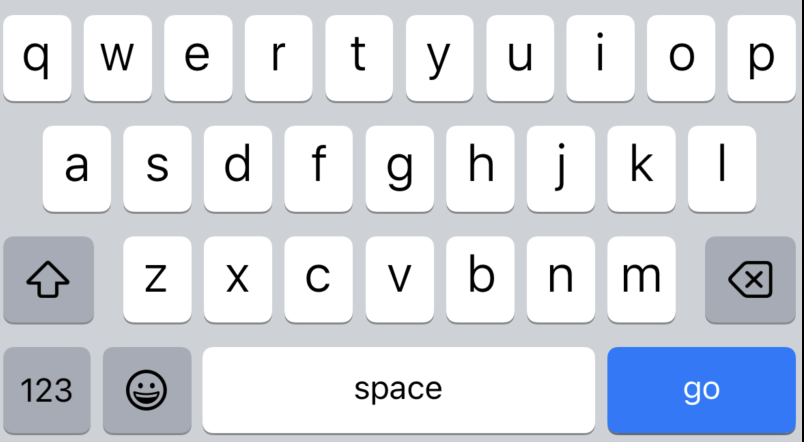

# 키보드의 종류(keyboardType)

### 키보드 타입 
```swift
textField.keyboardType = UIKeyboardType. ""
```
와 같이 뒤에 타입을 적어 자신이 원하는 키보드의 종류를 선택할 수 있다.

#### numberPad
```swift
textField.keyboardType = UIKeyboardType.numberPad 
```


와 같이 입력하면 이렇게 숫자를 입력할 수 있는 키보드가 나온다.

#### URL
```swift
textField.keyboardType = UIKeyboardType.URL 
```

와 같이 입력하면 이렇게 URL 입력할 수 있는 키보드가 나온다.


#### default
```swift
textField.keyboardType = UIKeyboardType.default
```

와 같이 입력하면 우리가 평소에 보던 키보드가 나온다.
더 많은 종류의 키보드가 궁금하다면
https://ikkison.tistory.com/18
여기에서 한번 봐보면 좋을듯 ! 
