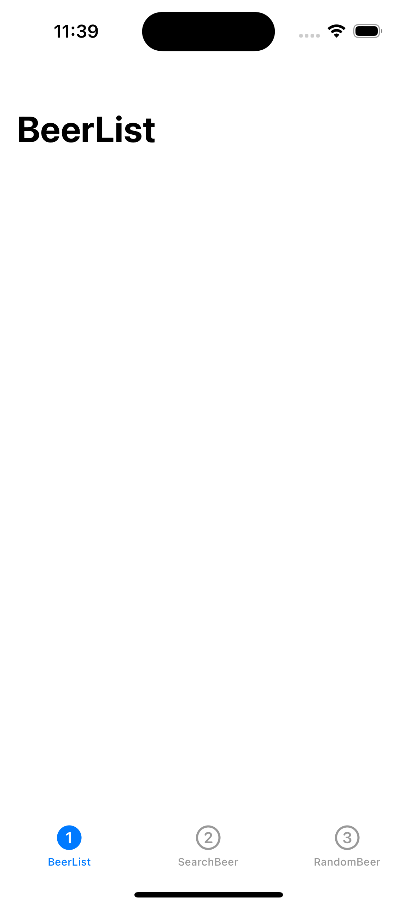
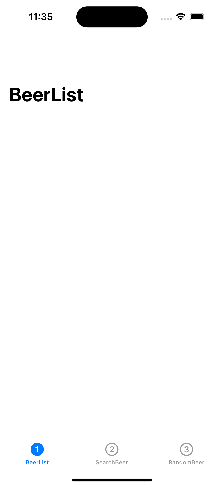

# navigationTitle이 아래로 보일때

### 원래


### 내가 보이는 화면


원래 이렇게 BeerList라는 글씨가 위에 보여야하는데 아래에 보여서 뭐가 문제인지 생각을 해보았다.

UITabbarController를 사용중이었는데 
```swift
let beerListVC = UINavigationController(rootViewController: BeerListViewController())
```
이렇게 BeerListViewController를 UINavigationController로 감싸준 뒤 UITabbarController의 일부로 사용을 하고, 
UITabbarController를 SceneDelegate부분에서 
```swift
let nav = UINavigationController(rootViewController: TabbarViewController())
```
이렇게 또 감싸줘 총 2번이나 UINavigationController로 감싸줘 생긴 문제인 것 같았다!

UINavigationController 위에 또 UINavigationController이 쌓이다 보니 생긴듯...

navigationTitle이 내가 생각하기보다 아래에 있다면 참고하면 좋을듯하다 ㅎㅎ