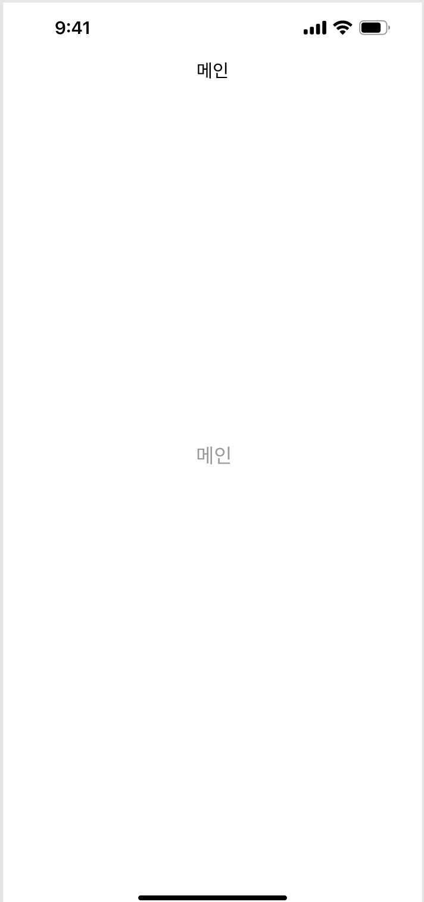

# navigationBarTitle
 
 

위 사진과 같이 navigationBarTitle을 "메인" 으로 해주려고 했는데 
```swift
self.title = "메인",
self.navigationItem.title = "메인", 
self.navigationController?.navigationBar.topItem?.title = "zedd"
```
과 같이 만들어줬는데도 navigationBarTitle이 공백으로 떠서 뭐가 오류인지 계속 생각을 해보았다.


이건 코드베이스로 iOS 앱을 만들때 해당하는 내용이다.

내가 navigationBarTitle이 계속 공백으로 나왔던 이유는 SceneDelegate의 파일에
```swift
 window?.rootViewController = UINavigationController(rootViewController: LoginViewController())
```
rootViewController를 UINavigationController로 설정을 해줘야 navigationBarTitle을 사용할 수 있다.