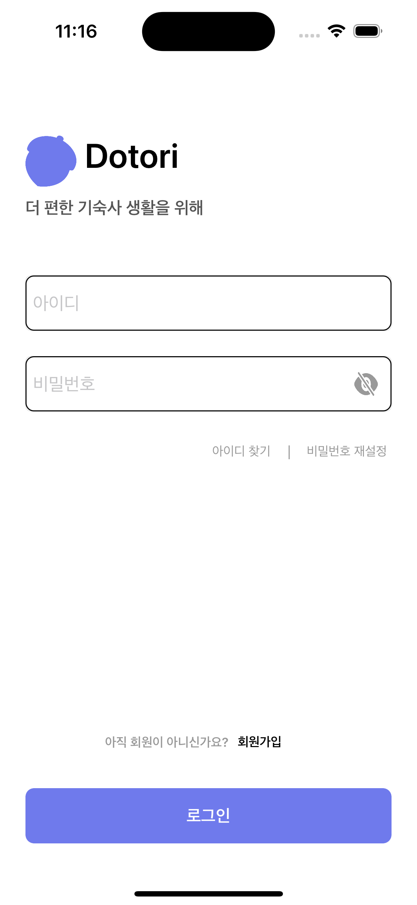

# 백버튼을 눌렀을때 navigationBarTitle 이 안보일때


이렇게 "로그인" 이라고 잘 보이던 navigationBarTitle이 다음 화면을 갔다가 백버튼을 누르면



이렇게 보이지 않는다.

해결법 : ``` viewDidLoad 이후에 실행되는 viewWillAppear 함수에 navigationBarTitle을 설정해주는 코드를 적었더니 됐다! ```
