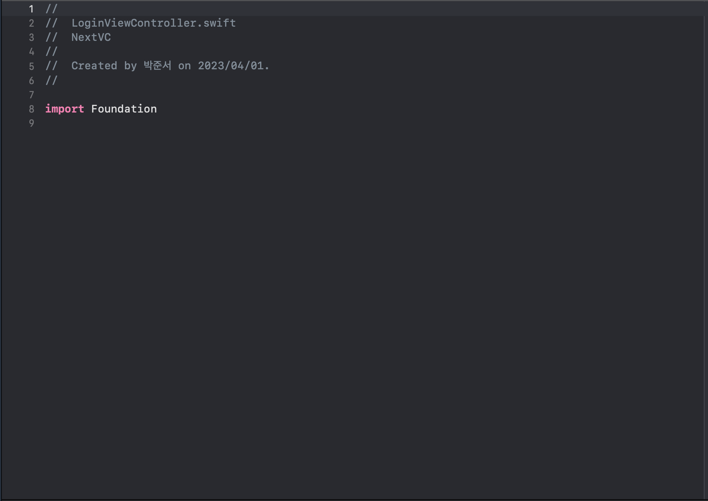
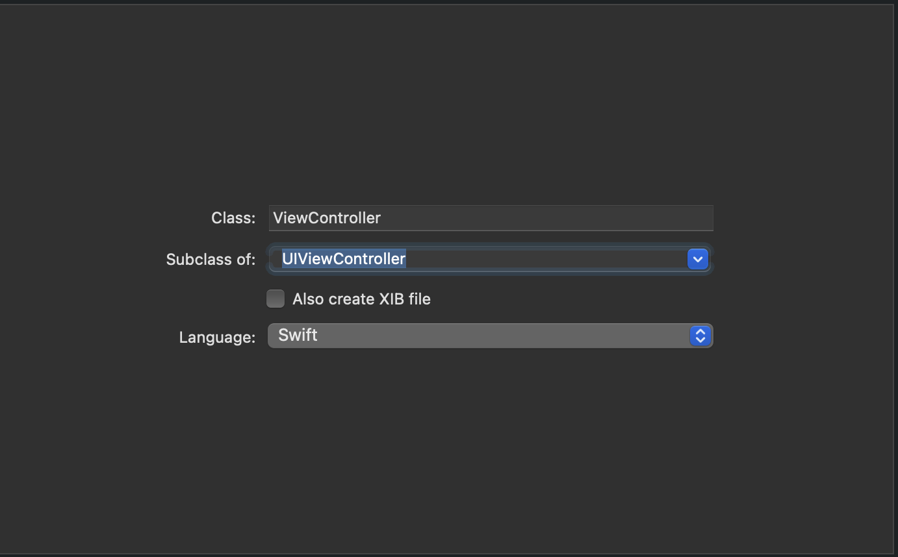

# 파일 생성 시 swift와 cocoaTouch 차이점

프로젝트를 하던 중 새로운 파일을 생성하려고 new file을 눌렀을 때 뜨는 swift와 cocoaTouch의 차이점이 무엇인지 궁금했다.


평소에 swift 파일만 선택을 하면 



이렇게 
``` swift 
import foundation 
```
만 적혀있는 걸 볼 수 있다.




하지만 cocoaTouch를 선택한 뒤 자신이 상속받을 클래스를 정하면 


이렇게 자동으로 자신이 사용할 클래스에 맞게 틀이 생긴 걸 볼 수 있다.

iOS 앱 개발 초보자들이 어떻게 파일


iOS 앱 개발 초보자들이 어떻게 파일을 만들어야될지 모르겠을때 위와 같이 하면 좋을 듯 하다! 