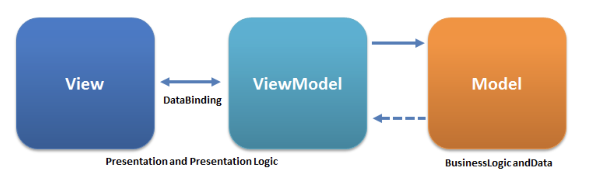

# MVVM

Model, View, ViewModel로 이루어진 아키텍처 패턴

### Model
- 데이터, 네트워크 로직, 비즈니스 로직을 담고 있다.
  
### View
- 사용자가 보이는 화면이다.
- Model을 알고 있어서는 안된다.
- 사용자로부터 상호작용을 하고 이에 대한 처리를 ViewModel에게 부탁한다.

### ViewModel
- View로부터 전달받은 요청을 처리할 로직을 담고 있다.
- Model에 변화가 데이터에 변화가 생긴걸 View가 알 수 있게 View에게 전달한다.

### MVVM 패턴의 장점
- UI를 선언적으로 정의하여 UI 와 관련된 내용만 깔끔하게 정리할 수 있다.
- 비즈니스 로직만 모아놓은 파일을 따로 정리할 수 있다.
- UI 와 비즈니스 로직을 거친 데이터를 동기화 상태를 유지할 수 있다.
  

### SwiftUI에서는 MVVM 사용을 하는게 손해일까??
ViewModel의 존재는 선언적 UI 시대에 필요 없다. 
SwiftUI의 MVVM은 APPLE이 공식적으로 추천한 방법이 아니다.
